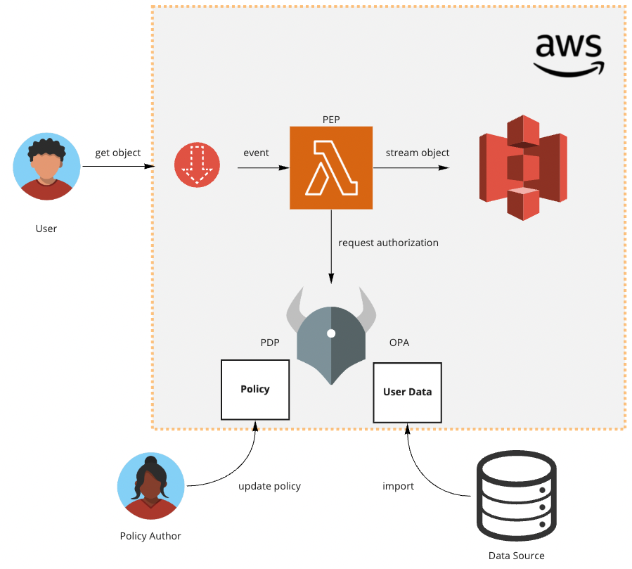

# Amazon S3 Authorization with Open Policy Agent (OPA)

This sample shows how to authorize requests to Amazon S3 using OPA policies. The main components are:
1. Data Bucket: An S3 bucket storing sample data authorized by the Object Lambda.
2. Object Lambda: This will be our Policy Enforement Point (PEP). Tha Object Lambda sends all information about the S3
request to OPA and enforces the resulting policy decision.
3. OPA + Rego policies: The Rego policies interpreted by the OPA runtime make the authorization decision. OPA needs to
be accessible from the Object Lamda. The policies have to conform to the request/response format excpected by the Object 
Lambda.

## Getting started

* The data files we are authorizing access to are stored in the S3 bucket "Data Bucket"
* The Object Lambda is deployed to AWS Lambda. The Lambda code is Java11.
* OPA can be deployed anywhere as long as the Object Lambda can access it over HTTP(S). I provide a manifest yaml for deployment to
Kubernetes.
* The Rego policies must be built as a Bundle and loaded into OPA.



1. Create an S3 bucket for storing the data files
2. Create a file named `.init` in the root of the cloned repo and provide values for each of the following keys:
```shell
DEPLOYMENT_BUCKET=
OBJECT_LAMBDA_AP=
OBJECT_LAMBDA_SUPPORTING_AP=
DATA_BUCKET=
DATA_BUCKET_AP_ARN=
```
The first 3 are inputs to the CloudFormation template creating the Lambda, so they can be of any valid values. The 
DATA_BUCKET and DATA_BUCKET_AP_ARN need to be filled based on the bucket created in step 1.
3. Build the Object Lambda jar file and create the AWS Lambda function. This can be done using the `s3-object-lambda/upload-lambda.sh`
script. You can run this script for subsequent updates to the Lambda function.
4. Load the policy code into Styra DAS (create a free tenant here if you don't have one yet: [https://signup.styra.com](https://signup.styra.com/)).
Create a new Custom type System in Styra DAS and configure it to point the repo or your fork of it (Styra DAS will ask for authentication even for a public repo).
```text
Repository path: bundle
```
5. Load the user data as a Datasource of the System. Create a new System level (or global as you prefer) datasource and point it to the Git repo
same as you did with the policy. It's the same Git repo with a different Repository Path.
```text
Path: leave it empty
Data source name: userdata
Repository path: bundle/userdata/data.json
```
Note: In case you don't want to use Styra DAS for managing the policy bundle you can use any other method that works with OPA. For example
Creating the policy bundle using `opa build` and uploading it to S3.
6. cd into the `user` directory for some testing
7. Use the `upload.sh` script to upload data1.csv under 3 different prefixes to S3 (one is no prefix, which will 
not be allowed to be downloaded by the policy).
7. Finally use `download.sh` to try to download the uploaded data files. You can try to download files with different prefixes
to see the results of the policy:
```shell
./download.sh prefix1/data1.csv
./download.sh prefix2/data1.csv
./download.sh data1.csv
```

## Object Lambda

The Object Lambda will perform the following function:
1. Receive a request to get an S3 object
2. Prepare a request to OPA with all information about the S3 object request
3. Receive the response and process it
4. If the response contains any deny messages, return an authorization error to the user
5. If the response 